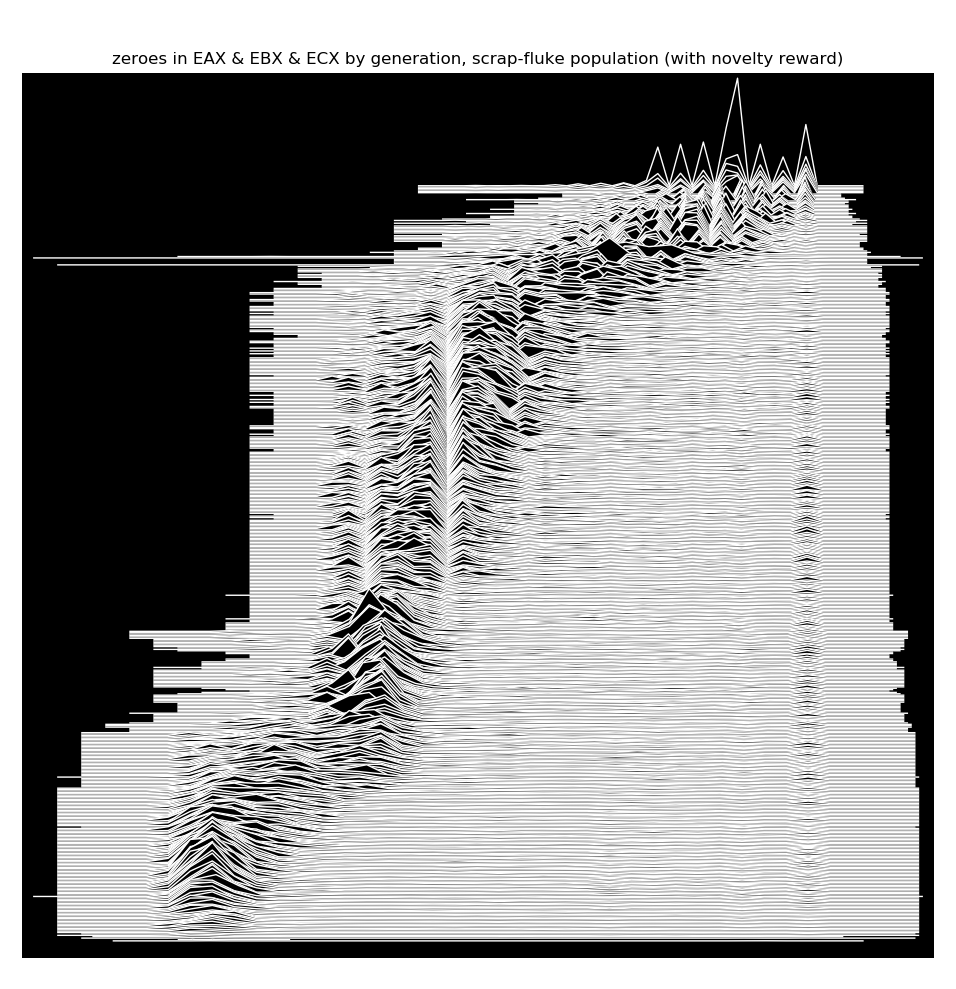

# Berbalang


## Evolutionary Exploration of Emergent Execution

*Berbalang* is a genetic programming laboratory principally dedicated to the
exploration of "weird machines" (or "emergent execution") through evolutionary
methods. At its core is a complete reimplementation of 
[ROPER](https://roper.eschatronics.ca), a system I designed while at Dalhousie
University, in 2018, to study the evolution of return-oriented programming (ROP)
payloads on the ARM architecture. A substantially overhauled and improved version
of ROPER can be found in the `berbalang::roper` module. 

In addition to `roper`, Berbalang includes a few other genetic programming testbeds
as well, including `berbalang::linear_gp`, a basic linear genetic programming system,
which evolves programs for a simple, register-transfer machine, and `berbalang::hello_world`,
a simple genetic algorithm system for evolving strings to match a given target.

## To Build

We'll assume that you plan to house Berbalang into `~/src/berbalang`.
First, clone the repository:
```$sh
[~/src]$ git clone https://github.com/oblivia-simplex/berbalang
[~/src]$ cd berbalang
``` 


### On NixOS

```$sh
[~/src/berbalang]$ nix-shell
...
[nix-shell:~/src/berbalang]$ cargo build --release
```

### Docker

TODO

### Gentoo

TODO

### Other Linux Distributions

TODO

## Running Experiments

First, set up a log directory. We'll assume that you chose `../logs` for this purpose. 
Then create a directory containing experiment specification files, following the example
provided in [berbalang/config.toml](./config.toml). Let's say you're using 
`./experiments/foobar/` as your experiment specification directory. 
Each `toml` file in that directory should specify the parameters for a series of trial runs.

Then, run, say, 100 trials for under each specification with
```$sh
[~/src/berbalang]$ ./trials.sh ./experiments/foobar 100 ../logs
```
The resulting logs will be available under
```$sh
../logs/berbalang/$JOB/$SELECTION_METHOD/$YEAR/$MONTH/$DAY
```

Python scripts and tools for analysing experiment data can be found in 
`berbalang/analysis`.


